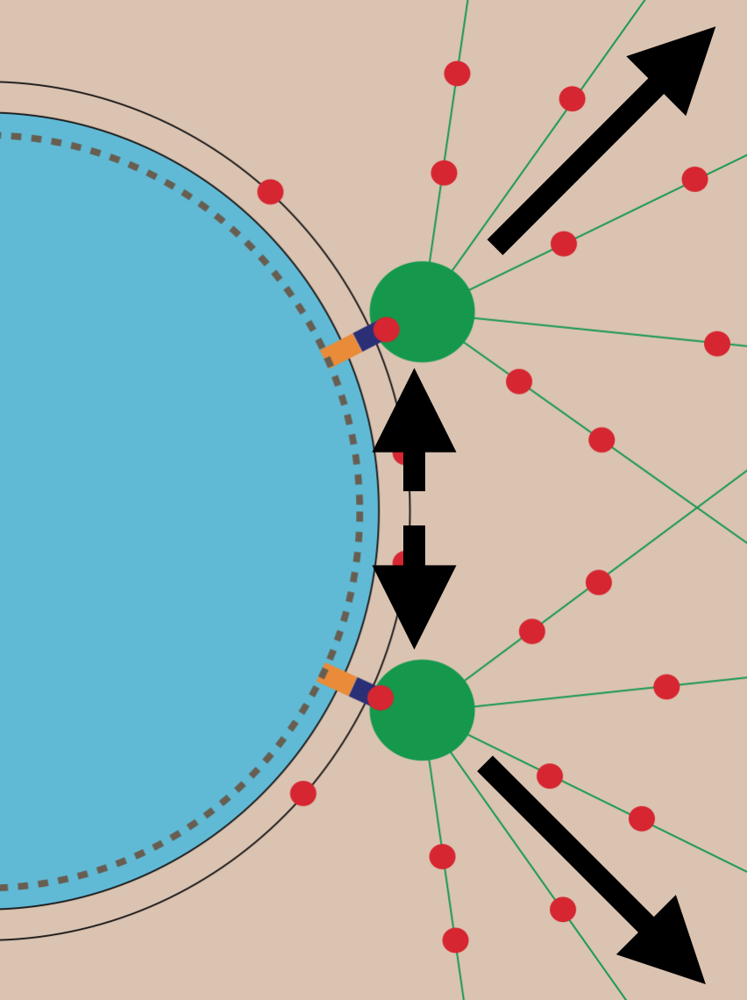
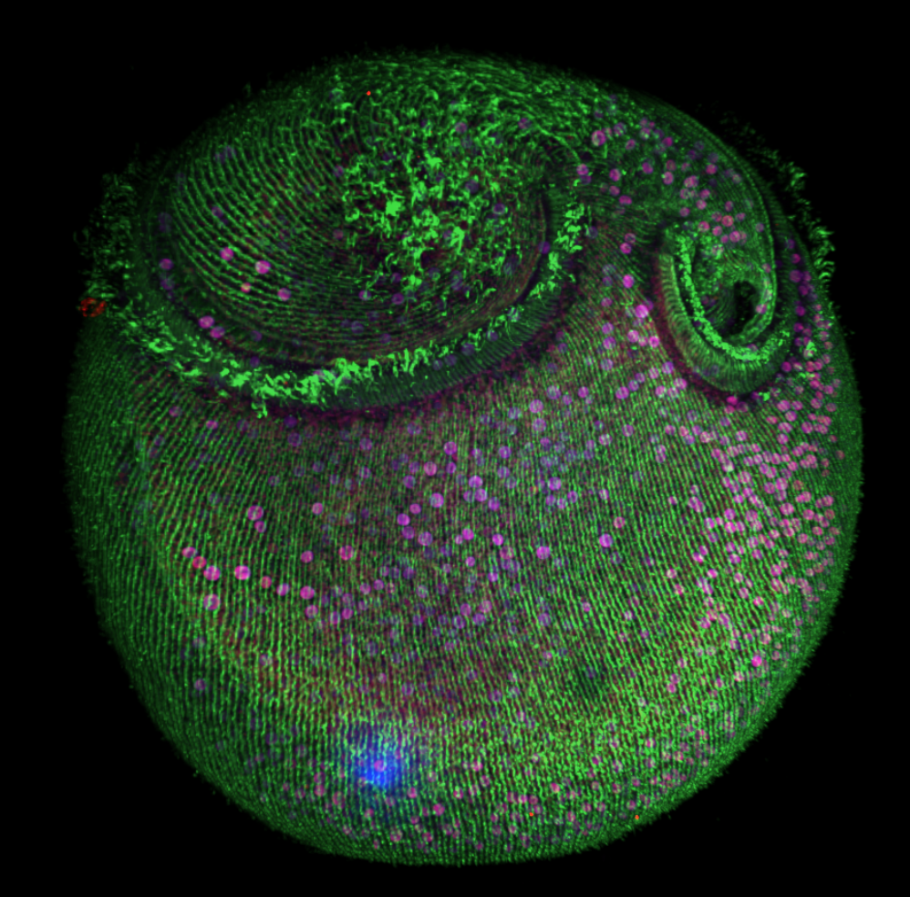

<!-- Main -->

<!-- One -->
<section id="one" class="spotlights">
	<section>
		
		

			

				<header class="major">
					<h3>How nuclei expand to form functional organelles</h3>
				</header>
				
Through a highly collaborative effort between our lab and the labs of Jay Gatlin, Jun Allard and Hernan Garcia, we used quantitative live-cell microscopy assays, mathematical modelling and several model systems to determine how the nucleus is assembled into a functional organelle. Using our model to predict nuclear assembly regulators, we uncovered a role for nucleo-cytoplasmic trafficking in modulating the amount of factors regulating nuclear surface area and hence, nuclear surface tension.

			

		

	</section>
	<section>
		
		

			

				<header class="major">
					<h3>Regulation of centrosome migration during mitotic spindle formation</h3>
				</header>
				
Having identified a functional interaction between a cell cycle phosphatase and a nuclear lamina component, we investigated the role for these components in regulating early mitotic events in the developing worm embryo. We uncover a role for the phosphatase and the nuclear lamina in regulating centrosome migration and positioning during mitotic spindle formation of the first embryonic mitosis.

			

		

	</section>
	<section>
		
		

			

				<header class="major">
					<h3>Structural, metabolic and behavioral relationship between a regenerative ciliate and its endosymbiotic algae</h3>
				</header>
				
Using a wild species of the large and regenerative unicellular ciliate, Stentor, we are studying the structural, metabolic and behavioural between the ciliate and its algal endosymbionts. Given that this organism is native to a pond in Woods Hole, MA, this project is being pursued in the context of the Marine Biological Laboratory's Physiology Course, an intensive summer research course for graduate students and post-doctoral fellows.

			

		

	</section>
</section>

<!-- Two -->
<section id="two">
	

		<header class="major">
			<h2>Publications</h2>
		</header>
		

<h4>Methods/protocols/chapters</h4>

Ryan J., Gerhold A.R., <b>Boudreau V.</b>, Smith L., Maddox P.S. (2017) Introduction to Modern Methods in Light Microscopy. In: Markaki Y., Harz H. (eds) Light Microscopy. Methods in Molecular Biology, vol 1563. Humana Press, New York, NY

