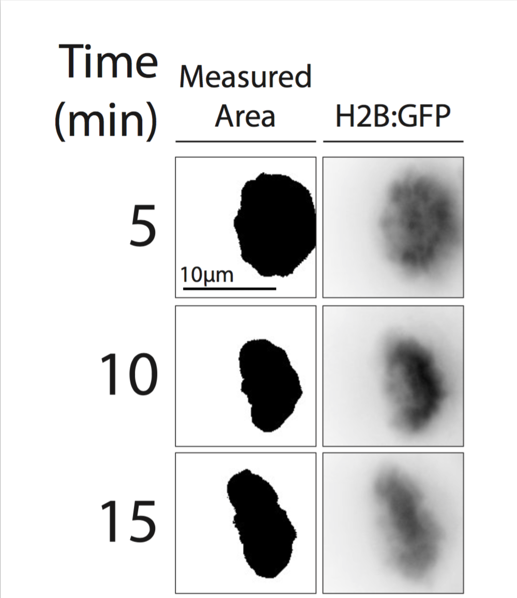
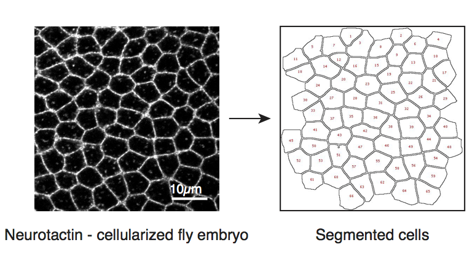
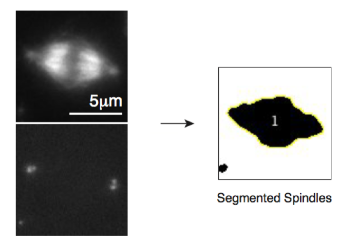
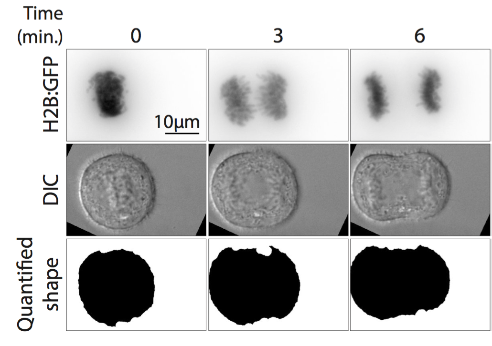

<!-- Main -->

<!-- One -->
<section id="one" class="spotlights">
	<section>
		
		

			

				<header class="major">
					<h3>Condensation Assay</h3>
				</header>
				
Originally developed by <a href="http://www.pnas.org/content/103/41/15097.abstract">Paul Maddox</a>, the condensation assay can be used to determine how much of a given cellular component is localized to a given structure. In its ImageJ format, the plugin first prompts the user to place a box over a given structure of interest in every frame in a time lapse movie, identifies the minimum and maximum intensity values in each box and thresholds fluorescence intensities within the identified dynamic range. This approach has been used to determine chromatin condensation state both during condensation and decondensation.

				<ul class="actions">
					<li><a href="https://github.com/viboud12/Condensation_Assay" class="button">Plugin</a></li>
				</ul>
			

		

	</section>
	<section>
		
		

			

				<header class="major">
					<h3>CellMorph</h3>
				</header>
				
Working with Mark Peifer's lab at UNC Chapel Hill, I made this ImageJ plugin to quickly measure cell size and shape in epithelial monolayers. Although this was developed to be used with images of cellularized fly embryos, this plugin could be applied to any monolayer stained for cell boundaries. Given the highly automated nature of this plugin, a version of the plugin is available to analyze entire folders of images. The analysis returns cell size information (area and perimeter) and cell shape information (circularity, aspect ratio, roundness, etc).

				<ul class="actions">
					<li><a href="https://github.com/viboud12/CellMorph" class="button">Plugin</a></li>
				</ul>
			

		

	</section>
	<section>
		
		

			

				<header class="major">
					<h3>MeasureSpindles</h3>
				</header>
				
Collaborating with Amy Byrnes in Kevin Slep's lab at UNC Chapel Hill, this plugin was inspired by <a href="https://www.ncbi.nlm.nih.gov/pmc/articles/PMC4828689/">Rebecca Heald's lab's work</a> to automate measurements of mitotic spindle lengths and to extract spindle size and shape information out of existing data. The plugin segments spindles either based on a microtubule stain or on a microtubule stain in addition to a centrosomal stain. Once the spindle is segmented, the analysis provides several size and shape measurements including the feret's diameter, which measures the longest distance between two points in the object, as a measurement of spindle length.

				<ul class="actions">
					<li><a href="https://github.com/viboud12/MeasureSpindles" class="button">Plugin</a></li>
				</ul>
			

		

	</section>
	<section>
		
		

			

				<header class="major">
					<h3>CellMorph</h3>
				</header>
				
Looking to take advantage of DIC images traditionaly used as reference images in live-cell fluorescence microscopy experiments, this plugin segments cells in DIC images to track cell shape changes over time. I used this approach to quantify cell shape change through the last steps of mitosis as cells go from a rounded, spherical shape to an elongated shape in anaphase, to a dumbell shaped cell in telophase.

				<ul class="actions">
					<li><a href="https://github.com/viboud12/DIC_Morphology_Assay" class="button">Plugin</a></li>
				</ul>
			

		

	</section>
</section>

</section>

